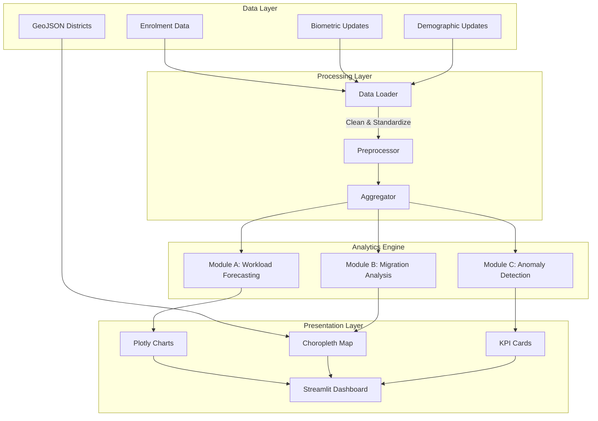
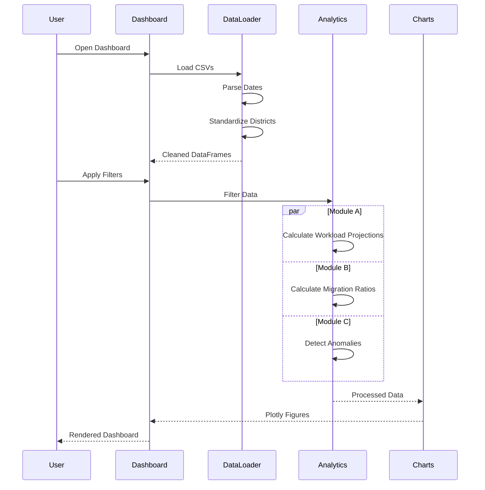
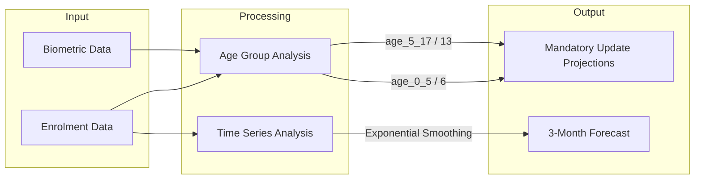
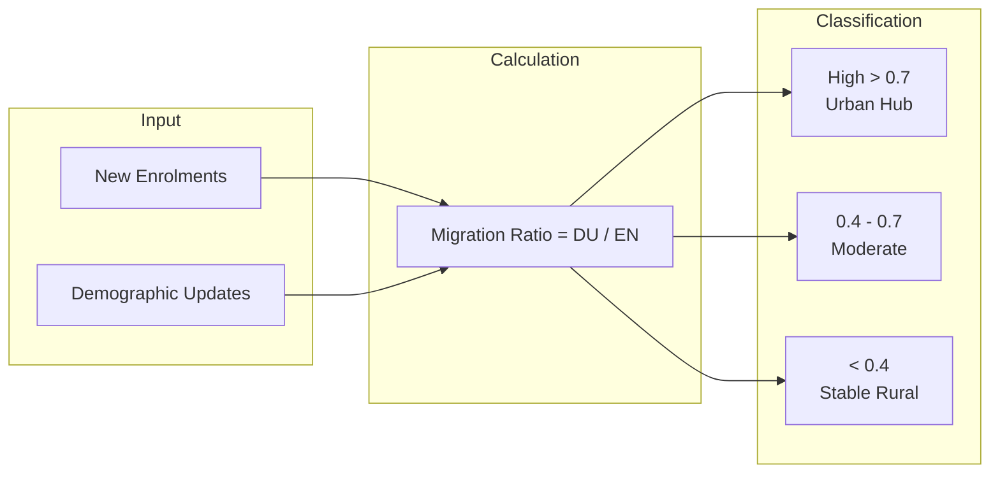
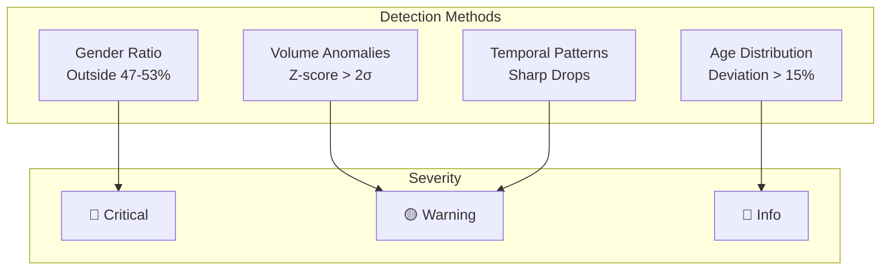

# 🏗️ UIDAI Ops-Intel Dashboard - Architecture

## 1. Executive Summary

The UIDAI Ops-Intel Dashboard is a District Operational Intelligence system for Telangana that:
- **Predicts workload** based on age-triggered mandatory updates
- **Analyzes migration patterns** through demographic update ratios
- **Detects anomalies** in enrolment data quality

---

## 2. System Architecture



---

## 3. Data Flow



---

## 4. Module Architecture

### Module A: Workload Forecasting



**Logic:**
- Children aged 4 (1/6 of age_0_5) → Must update at age 5
- Children aged 14 (1/13 of age_5_17) → Must update at age 15

### Module B: Migration Analysis



### Module C: Anomaly Detection



---

## 5. Tech Stack

| Layer | Technology |
|-------|------------|
| **Frontend** | Streamlit 1.31+ |
| **Visualization** | Plotly 5.18+ |
| **Data Processing** | Pandas, NumPy |
| **Forecasting** | Statsmodels (Exponential Smoothing) |
| **Geospatial** | GeoJSON + Plotly Mapbox |
| **Styling** | Custom CSS (UIDAI Branding) |

---

## 6. Directory Structure

```
Project/
├── app.py                    # Entry point
├── requirements.txt          # Dependencies
│
├── src/
│   ├── config.py            # Constants & thresholds
│   ├── data_loader.py       # Data ingestion
│   │
│   ├── analytics/
│   │   ├── workload_forecasting.py   # Module A
│   │   ├── migration_analysis.py     # Module B
│   │   └── anomaly_detection.py      # Module C
│   │
│   └── components/
│       ├── styles.py        # CSS injection
│       └── charts.py        # Chart factories
│
├── Datasets/                # Input data
├── assets/                  # GeoJSON
└── docs/                    # Documentation
```

---

## 7. Configuration

Key thresholds defined in `src/config.py`:

```python
# Workload Forecasting
AGE_MANDATORY_UPDATE_5 = 5
AGE_MANDATORY_UPDATE_15 = 15

# Migration Analysis
MIGRATION_THRESHOLD_HIGH = 0.7
MIGRATION_THRESHOLD_MEDIUM = 0.4

# Anomaly Detection
GENDER_RATIO_LOWER = 0.47
GENDER_RATIO_UPPER = 0.53
ANOMALY_STD_THRESHOLD = 2.0
```

---

## 8. Branding

Following UIDAI guidelines:

```css
--uidai-red: #B72025;
--uidai-yellow: #FDB913;
--background: #FFFFFF;
--text-primary: #1A1A2E;
```

---

## 9. Deployment

### Local Development
```bash
pip install -r requirements.txt
streamlit run app.py
```

### Production (Streamlit Cloud)
1. Push to GitHub
2. Connect repository to Streamlit Cloud
3. Set Python version: 3.9+
4. Deploy

---

*Document generated for UIDAI Data Hackathon 2026*
