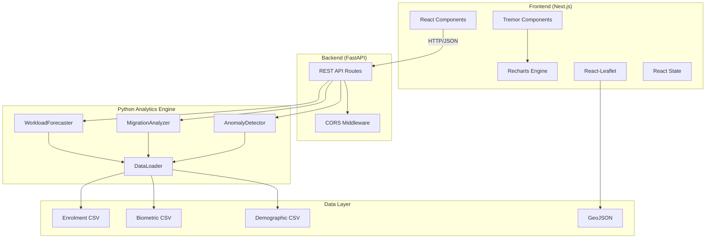
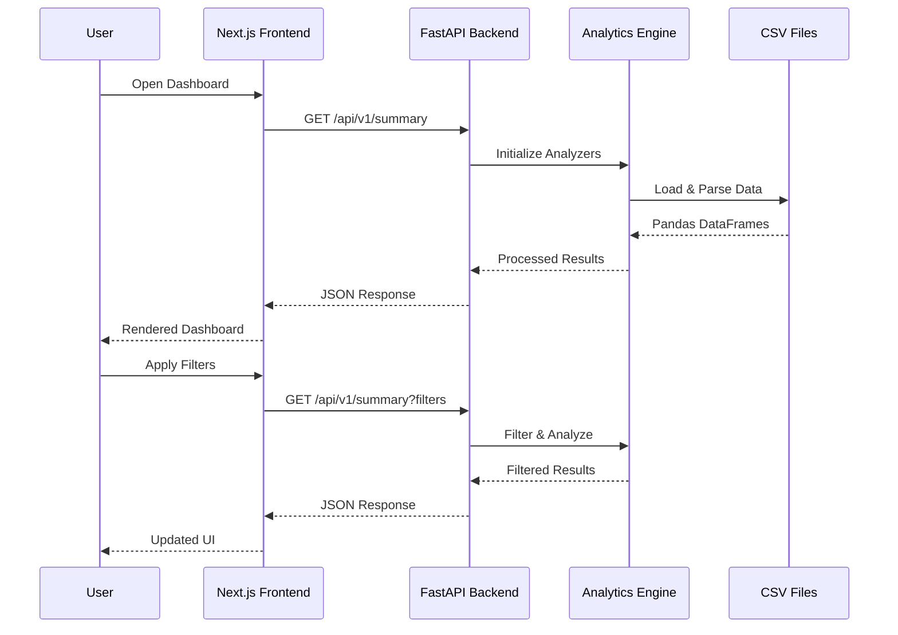

# 🏗️ UIDAI Ops-Intel Dashboard - Architecture V2

## 1. Executive Summary

The UIDAI Ops-Intel Dashboard is a **Next.js + FastAPI** full-stack application for District Operational Intelligence in Telangana. This version introduces a modern, decoupled architecture with:

- **Frontend**: Next.js 14 (App Router) with Tailwind CSS & Framer Motion
- **Backend**: FastAPI (Python) exposing REST APIs
- **Data Layer**: CSV files (no database required for hackathon)

---

## 2. System Architecture



---

## 3. Tech Stack

| Layer | Technology | Purpose |
|-------|------------|---------|
| **Frontend** | Next.js 14 | React framework with SSR/SSG |
| **Styling** | Tailwind CSS | Utility-first CSS |
| **Animations** | Framer Motion | Smooth animations |
| **Charts (UI)** | Tremor | Dashboard components & wrappers |
| **Charts (Engine)** | Recharts | Underlying charting library |
| **Map** | React-Leaflet | Interactive choropleth map |
| **Backend** | FastAPI | High-performance Python API |
| **Data Processing** | Pandas, NumPy | Analytics engine |
| **Forecasting** | Statsmodels | Time series forecasting |

---

## 4. Directory Structure

```
Project/
├── frontend/                      # Next.js Application
│   ├── src/
│   │   ├── app/
│   │   │   ├── layout.tsx        # Root layout
│   │   │   ├── page.tsx          # Main dashboard
│   │   │   └── globals.css       # Global styles
│   │   ├── components/
│   │   │   ├── ui/               # Reusable UI components
│   │   │   │   ├── KPICard.tsx
│   │   │   │   ├── SectionHeader.tsx
│   │   │   │   ├── AlertBadge.tsx
│   │   │   │   └── ChartContainer.tsx
│   │   │   ├── charts/           # Chart components
│   │   │   │   ├── ForecastChart.tsx
│   │   │   │   ├── ProjectionChart.tsx
│   │   │   │   ├── DistrictBarChart.tsx
│   │   │   │   ├── AgeDistributionChart.tsx
│   │   │   │   └── HealthGauge.tsx
│   │   │   ├── map/
│   │   │   │   └── DistrictMap.tsx
│   │   │   └── layout/
│   │   │       └── Sidebar.tsx
│   │   └── lib/
│   │       ├── api.ts            # API client
│   │       └── utils.ts          # Utilities
│   ├── package.json
│   ├── tailwind.config.ts
│   └── next.config.js            # API proxy config
│
├── backend/                       # FastAPI Application
│   ├── main.py                   # API routes & entry point
│   └── requirements.txt
│
├── src/                          # Shared Python Analytics
│   ├── analytics/
│   │   ├── workload_forecasting.py
│   │   ├── migration_analysis.py
│   │   └── anomaly_detection.py
│   ├── data_loader.py
│   └── config.py
│
├── Datasets/                     # CSV Data Files
├── assets/                       # GeoJSON & Static Assets
└── docs/                         # Documentation
```

---

## 5. API Endpoints

### Summary Endpoints

| Method | Endpoint | Description |
|--------|----------|-------------|
| GET | `/api/health` | Health check |
| GET | `/api/v1/summary` | Complete dashboard summary |
| GET | `/api/v1/config` | Dashboard configuration |

### Module A: Workload Forecasting

| Method | Endpoint | Description |
|--------|----------|-------------|
| GET | `/api/v1/workload/forecast` | Historical + forecast data |
| GET | `/api/v1/workload/projections` | Mandatory update projections |

### Module B: Migration Analysis

| Method | Endpoint | Description |
|--------|----------|-------------|
| GET | `/api/v1/migration/choropleth` | Map data |
| GET | `/api/v1/migration/trends` | Monthly trends |
| GET | `/api/v1/geojson` | Telangana GeoJSON |

### Module C: Anomaly Detection

| Method | Endpoint | Description |
|--------|----------|-------------|
| GET | `/api/v1/anomalies` | Detected anomalies |
| GET | `/api/v1/districts/health` | Health scores |

### Additional Endpoints

| Method | Endpoint | Description |
|--------|----------|-------------|
| GET | `/api/v1/enrolments/by-district` | District aggregates |
| GET | `/api/v1/enrolments/age-distribution` | Age breakdown |

---

## 6. Data Flow



---

## 7. UI Components

### KPI Cards (Tremor Card + Metric)
- Animated entry with Framer Motion
- Top decoration with UIDAI colors
- BadgeDelta for trend indicators
- Icon backgrounds

### Charts (Tremor + Recharts Hybrid)
Tremor provides pre-styled chart components built on top of Recharts engine:
- **ForecastChart**: Tremor AreaChart → Recharts AreaChart (historical + forecast)
- **ProjectionChart**: Tremor BarChart → Recharts BarChart (stacked, vertical)
- **DistrictBarChart**: Tremor BarChart → Recharts BarChart (rose color)
- **AgeDistributionChart**: Tremor DonutChart → Recharts PieChart (with Legend)
- **HealthGauge**: Tremor ProgressCircle (custom component)
- **MigrationTrendChart**: Tremor AreaChart → Recharts AreaChart (trend lines)

**Architecture Pattern**: 
```
React Component → Tremor Component → Recharts Primitive → SVG Rendering
```

### Tables (Tremor)
- Table, TableHead, TableBody, TableRow, TableCell
- Badge for severity indicators
- Clean, modern styling

### Tabs (Tremor TabGroup)
- TabList, Tab, TabPanels, TabPanel
- Age Distribution, Trend Analysis, Anomaly Details

### Map (React-Leaflet)
- Choropleth map of Telangana districts
- Color-coded by migration intensity
- Interactive popups
- Legend overlay

### Sidebar
- Collapsible on mobile
- District multi-select filter
- Date range picker
- Real-time anomaly alerts

---

## 8. Development

### Prerequisites
- Node.js 18+
- Python 3.9+
- npm or yarn

### Backend Setup
```bash
cd backend
pip install -r requirements.txt
python main.py
# Runs on http://localhost:8000
```

### Frontend Setup
```bash
cd frontend
npm install
npm run dev
# Runs on http://localhost:3000
```

### API Proxy
The Next.js config proxies `/api/*` to the FastAPI backend:
```javascript
// next.config.js
async rewrites() {
  return [
    {
      source: '/api/:path*',
      destination: 'http://localhost:8000/api/:path*',
    },
  ];
}
```

---

## 9. Deployment

### Option A: Vercel + Railway
- **Frontend**: Deploy to Vercel
- **Backend**: Deploy to Railway (Python)
- Update `NEXT_PUBLIC_API_URL` env variable

### Option B: Single Server (Docker)
```dockerfile
# Dockerfile.backend
FROM python:3.11-slim
WORKDIR /app
COPY backend/ .
COPY src/ ./src/
COPY Datasets/ ./Datasets/
COPY assets/ ./assets/
RUN pip install -r requirements.txt
CMD ["uvicorn", "main:app", "--host", "0.0.0.0", "--port", "8000"]
```

---

## 10. UIDAI Branding

### Colors
```css
--uidai-red: #B72025;
--uidai-yellow: #FDB913;
--background: #F8FAFC;
--text-primary: #0F172A;
```

### Gradients
- Primary: `linear-gradient(135deg, #B72025, #FDB913)`
- Card Accents: Red-to-yellow top border

---

*Document updated for UIDAI Data Hackathon 2026 - Next.js + FastAPI Architecture*
